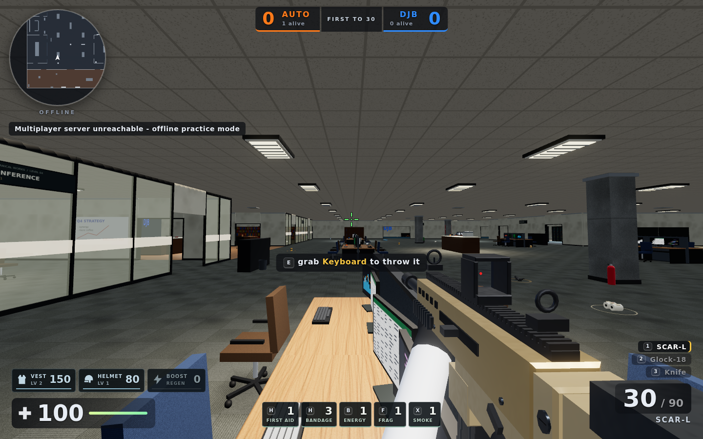

# mechanical war.io

A Counter-Strike-style multiplayer office shooter that runs directly in the browser and deploys as a static GitHub Pages site. AUTO vs DJB, one office, first team to 30 eliminations.

## Play

1. Type a callsign, pick a department (**AUTO** or **DJB**) and an operative.
2. Press **PLAY**. There is exactly one room: the first player in becomes the host, everyone else walks straight in.

**RH** (Ressources Humaines) is listed too. It is not a playable department. Try it anyway.

### Operatives

| Operative | Look |
| --- | --- |
| The Manager | Bald, glasses, tie, synergy |
| Vape Guy | Backwards cap, stubble, vape pen (clouds included) |
| The Intern | Messy hair, backpack, lanyard |
| IT Guy | Ponytail, beard, headset, shorts |
| Sales Bro | Slick hair, sunglasses, gold watch |
| Coffee Queen | Bun, earrings, coffee on the vest |

### Controls

| Key | Action |
| --- | --- |
| WASD / ZQSD | Move (layout-independent) |
| Shift | Walk (silent footsteps) |
| Ctrl / C | Crouch; crouch mid-jump to tuck your legs and land on desks |
| Space | Jump |
| Mouse | Aim / fire, right-click scopes the AWP |
| E | Pick up weapons, armor, helmets or supplies; grab an office prop |
| H / B | Use first aid (or bandage) / energy drink; press again to cancel |
| F / X | Throw a frag / smoke grenade |
| LMB with a prop | Hold to charge, release to throw it at someone |
| R / G / V | Reload / drop / emote |
| 1-4, wheel | Primary, pistol, knife, held prop |
| Tab | Scoreboard |
| Esc | Pause and settings |

Touch devices get a floating move stick, drag-to-look and FIRE / JUMP / DUCK / R / USE / SWAP / SCOPE buttons, plus HEAL / BOOST / FRAG / SMOKE with inventory counts.

### Weapons and props

Knife (backstabs kill), Glock-18, MP5, UMP-45, Nova, AK-47, M4A4, SCAR-L, AWP and RPG-7, each with its own damage, head multiplier, spray recoil, spread, reload, move speed and procedural sound. Floor weapons are spread through the office (AWP in the CEO office, M4 in the server room, RPG at reception...).

Keyboards, mugs, staplers, phones, laptops, monitors, extinguishers, plants, bins, office chairs and printers can all be picked up and thrown; heavier items slow you down and hurt more.

## Tactical survival update



Development preview in offline practice mode, with scavenged equipment.

The office keeps its AUTO vs DJB team-deathmatch format. Both spawn areas have basic supplies; better combat vests sit in the contested office. Look at a floor item and press **E**. Items restock after 30–55 seconds, depending on type. Everyone respawns with 100 HP, a pistol and a knife; armor and supplies must be scavenged again.

| Item | Effect |
| --- | --- |
| Patrol vest | Absorbs 30% of body damage; 100 durability |
| Combat vest | Absorbs 40% of body damage; 150 durability |
| Ballistic helmet | Absorbs 50% of head damage; 80 durability |
| Bandages | Pack of 3; each heals 20 HP after a 3-second use, up to 75 HP |
| First aid kit | 5-second use restores health to 75 HP |
| Energy drink | 3-second use adds 40 boost; boost drains by 1 per second and gradually heals up to 100 HP |
| Frag grenade | 3-second fuse, bouncing trajectory, 7 m blast radius; walls block damage, teammates are immune, self-damage is reduced |
| Smoke grenade | 2-second fuse, 4.5 m cloud radius lasting 16 seconds; conceals player models and labels, bullets still pass through |

Armor loses durability by the damage it absorbs; knives bypass armor. First aid and bandages cannot heal above 75 HP. Boost heals 1 HP per second, rising to 1.5 HP per second above 60 boost. Carry limits: 8 bandages, 3 first-aid kits, 4 energy drinks, 3 frags and 3 smoke grenades. Moving more than 0.6 m from the use position, taking damage, firing or throwing cancels medical/boost use without consuming the item. **H** prefers first aid when available. **G** remains weapon/prop drop.

Graphics use original procedural assets: worn carpet and wall surfaces, separate height/roughness maps, beveled desk tops, window blinds, recessed fluorescent fixtures, office service details, baked contact shadows, softer bloom and more detailed weapon models. Low quality retains the material/detail improvements; higher presets add dynamic shadows and postprocessing. This is a browser-friendly step toward a grounded Source-era office aesthetic.

The new gameplay protocol uses the v5 room so old clients cannot accidentally join an incompatible match. Host migration starts a fresh survival state; armor, consumables, boost and active grenades do not transfer to the newly elected host.

## Visual fidelity update

The office now uses physical surface detail instead of deriving relief from paint color:
carpet fibers and seams, wood pores, concrete aggregate and joints, recessed ceramic
grout, and brushed metal. Normal/roughness maps are deterministic, generated once,
shared across materials, and require no texture downloads. Ceramic checker colors
no longer incorrectly change the height of the tiles.

High and Ultra add subtle screen-space ambient occlusion around desk legs, frames
and room corners. Glass, smoke and floor decals are excluded from the depth pass;
first-person hands/weapons and the HUD are drawn after AO and bloom to stay crisp.
A small generated office reflection environment adds cool window bands and warm
ceiling-strip highlights on metal, glass and weapons. It is baked once at startup.

- Low: all material upgrades, baked contact shadows, no dynamic shadows/postprocessing
- Medium: materials and dynamic shadows, native antialiasing, no AO/postprocessing
- High: half-resolution 16-sample AO, restrained HDR bloom, up to 8x anisotropy
- Ultra: 32-sample AO at 75% resolution, up to 16x anisotropy; AO width/height capped at 1600

Physical render pixels are capped per preset (1.6/2.4/3.6/6 megapixels), including
on resize, to avoid unexpectedly large retina/4K buffers. Composer targets use the
same resolution as the drawing buffer; DPR is no longer applied twice to effect
passes at startup. GPUs without WebGL2/float color-buffer support fall back to the
direct renderer rather than attempting the HDR/AO pipeline. Quality changes still
apply on the next match. Gameplay, cover, multiplayer protocol and touch controls
are unchanged.

## Architecture

No build step: plain ES modules, three.js 0.160 via an import map and PeerJS 1.5 from CDN.

- `src/main.js` wires the menu, loading, pause and settings overlays.
- `src/menu.js` renders the menu, the 3D character preview and the RH gag.
- `src/game.js` handles rendering, input, movement, combat, the viewmodel, network apply and the HUD loop.
- `src/touch.js` implements the mobile controls.
- `src/host.js` is the host-authoritative match state: validation, damage, pickups, prop physics, scoring and snapshots.
- `src/net.js` manages the single fixed room: host-or-join, retries, offline fallback and host-loss signalling.
- `src/world.js` builds the office map (desks, colliders you can stand on, lighting, radar data). It uses `src/textures.js` for procedural canvas textures and materials, and `src/geometry.js` for static batching helpers.
- `src/weapons.js`, `src/characters.js` and `src/props.js` build the weapon models and first-person arms, the character rigs (IK arms) and the throwable props with their physics.
- `src/graphics.js` owns the office reflection stage, quality-scaled AO and render pixel budgets.
- `src/fx.js` and `src/audio.js` provide the effects and procedural WebAudio sound.
- `src/survival.js` defines supply balance, spawn locations, grenade physics and cover intersection. `src/supplies.js` builds loot models and bounded tactical smoke.
- `src/hud.js` draws the CS-style HUD: radar, kill feed, scoreboard and damage indicators.
- `src/config.js` holds teams, characters, weapons, props, quality presets and saved settings.

If the host leaves, the remaining players reconnect and one of them takes over as host automatically. When the PeerJS broker cannot be reached, the game starts an offline practice session.

## Local development

```bash
npm ci
npx playwright install chromium
npm test
npm start
```

`npm test` runs module syntax checks, host-authority tests and Playwright gameplay tests against a mocked PeerJS broker. Coverage includes existing movement/props/multiplayer, armor, healing/boost, grenade physics and cover, smoke lifetime, new weapons, and late joins. Browser tests use a pinned local copy of Three.js, so CDN outages do not affect the results. Production still uses the static import map. Graphics regressions additionally cover all
four presets, high-DPI resize, scope/FOV projection, smoke/transparency preservation,
mobile controls, material-map caching, and render budgets. The pull-request workflow
runs assets/authority, gameplay and graphics in parallel and retains `game-test-results-*` for seven days, including matched-camera
before/after office and kitchen screenshots when a PR base commit is available.
Screenshots are review evidence, not pixel-perfect golden-image assertions.
Gameplay tests retain real input/network/HUD checks but skip repeated GPU draws after
match startup, then render again after tactical scenarios; graphics tests independently
submit full frames. Prop/reload timers
are advanced through the production simulation functions rather than wall-clock
sleeps, so slow software rendering cannot decide whether a gameplay test passes.

If Chromium is already installed in a constrained development environment, set
`PLAYWRIGHT_CHROMIUM_EXECUTABLE_PATH` to its executable path. Otherwise use the pinned
Playwright browser installation above.

To play locally, double-click `play-local.cmd` (Windows), or run the command below. Opening `index.html` directly from disk does not work: browsers block ES modules on `file://` pages.

```bash
npm start
```

Then open `http://127.0.0.1:4173` (open two tabs to play against yourself).

## Deployment

GitHub Pages can serve the repository root directly; all local assets use relative paths. A network connection is required on first load for the CDN runtimes, and the public PeerJS broker plus WebRTC connectivity are required for multiplayer.

When publishing CSS or JavaScript changes, update the `?v=` release key throughout `index.html` (stylesheet, module entry point, and local import-map entries). Keep every local module in that map; `npm test` checks that the release keys agree. This prevents a fresh page from reusing incompatible cached assets. HUD icons also have intrinsic dimensions so a missing or stale stylesheet cannot enlarge them over the game. If an already-open tab shows the old HUD after deployment, reload with Ctrl+Shift+R (Cmd+Shift+R on macOS).

## Known limitations

- WebRTC may fail on restrictive networks without a dedicated TURN relay.
- The host performs sanity validation (weapon ownership, damage caps, range, cadence), but a dedicated server would still be needed for real anti-cheat.
- Procedural audio starts only after a user interaction because of browser autoplay policies.
